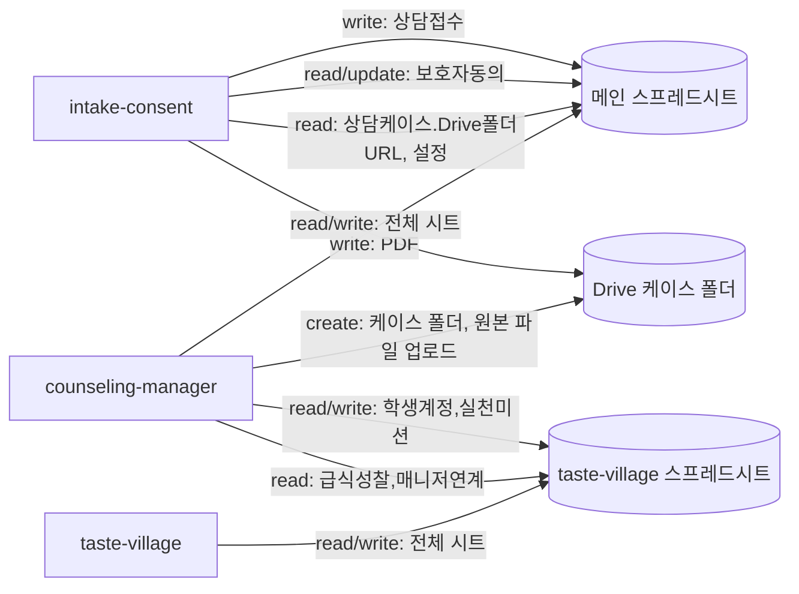

# Google 데이터 인벤토리 (google-data-inventory)

> `legacy/` 3개 프로젝트 코드에서 확인된 모든 Google Sheets 탭, Drive 폴더 구조, Docs/PDF 생성 기능을 정리합니다. 실제 시트 원본(헤더 export)은 저장소에 없으므로(`legacy/sheet-structure/`가 비어 있음), 아래 컬럼 목록은 소스 코드의 객체 리터럴/헤더 상수에서 역산한 것입니다.

## 1. 메인 스프레드시트 (마스킹 `19MY****YMbI`)

`counseling-manager`의 `getActiveSpreadsheet()` 대상이며, `intake-consent`가 `DATA_SPREADSHEET_ID`로 동일 파일을 `openById`합니다.

| 시트명 | 사용 프로젝트 | 읽기 함수 | 쓰기 함수 | 식별 열 | 관계 | 범용화 시 필요한 변경 |
|---|---|---|---|---|---|---|
| 학생정보 | counseling-manager | `studentMap_`(`code.gs.txt:5836`) | `upsertStudent_`(`5853`) | 학생코드 | 상담케이스.학생코드가 참조 | tenantId 컬럼 추가 필요 |
| 상담접수 | counseling-manager, intake-consent | `listPendingIntakes`(`2945`) | intake-consent `submitPublicIntake_`(`48-71`), counseling-manager `approveIntake`(상태갱신, `2967`) | 접수ID | 승인 시 상담케이스 생성 | intake-consent와 스프레드시트를 공유하는 구조를 tenantId 기반 API 호출로 전환 필요 |
| 상담케이스 | counseling-manager, intake-consent(읽기) | `listCases`(`3106`) | `createCaseFromIntakeRow_`(`3019`), `updateCaseStatus`(`5572`) | 케이스번호 | 허브 테이블(대부분 시트가 케이스번호로 조인). `Drive폴더URL` 컬럼을 intake-consent가 읽어 PDF 저장 경로 결정 | tenantId 필수 추가, Drive폴더URL을 공개 노출 경로에서 제거 |
| 보호자동의 | counseling-manager, intake-consent | `listConsentCases`(`3409`) | counseling-manager `generateConsentLink`(`3456`), intake-consent `submitGuardianConsent_`(update만, `170`) | 케이스번호(갱신 키), 동의토큰(조회 키) | 상담케이스 1:1 | 토큰 만료시각 컬럼 추가 필요(`integration-flow.md` 참고) |
| 진단결과 | counseling-manager | `getDiagnosisRowsForCase_`(`3830`) | `saveDiagnosis`(`4304`), `mapExtractedDiagnosis_`(Gemini 결과 매핑) | 진단ID+케이스번호 | 상담케이스 1:N(사전/사후) | 없음(구조상 큰 변경 불요) |
| 상담회기 | counseling-manager | `getPreviousSessionSummary`(`4653`) | `saveSession`(`5476`) | 회기ID+케이스번호 | 상담케이스 1:N | 없음 |
| 실천목표 | counseling-manager | `listCases`(goalMap, `3118`) | `saveSession`(`5503`) | 목표ID+케이스번호+회기ID | 상담회기 1:N. taste-village `실천미션`과 동기화 대상 | 없음 |
| 목표점검 | counseling-manager | `getGoalCheckData`(`5298`) | `saveGoalCheck`(`5351`) | 점검ID+목표ID | 실천목표 1:N | 없음 |
| 생성문서 | counseling-manager | `getCaseDetailRaw_`(`3180`, 읽기만) | **쓰기 코드 확인되지 않음** | 미상 | 상담케이스 | 실제 용도 재확인 필요 |
| 효과평가 | counseling-manager | `getEffectGrowthData`(`4472`) | `saveEffectEvaluation`(`4366`), Google Form 자동연계(`handleEffectEvaluationFormSubmit`, `572`) | 평가ID+케이스번호+평가시점 | 상담케이스 1:N(사전/사후) | 없음 |
| 성장측정 | counseling-manager | `getEffectGrowthData`(`4480`) | `saveGrowthMeasurement`(`4416`), `saveGrowthFromDiagnosis_`(`4323`) | 측정ID+케이스번호 | 상담케이스 1:N | 없음 |
| 다음회기준비 | counseling-manager | `buildNextSessionPreparationContext_`(`4990`) | `saveNextSessionPreparation`(`5236`) | 준비ID+케이스번호 | 상담회기 참조 | 없음 |
| 일정관리 | counseling-manager | `listDashboardEvents_`(`2406`) | `saveDashboardManualSchedule`(`2206`) | 일정ID | 케이스번호(옵션) | 없음 |
| 일정완료 | counseling-manager | `getDashboardCompletionMap_`(`2587`) | `toggleDashboardScheduleCompletion`(`2621`) | 완료키 | 일정/케이스 참조 | 없음 |
| 설정 | counseling-manager, intake-consent(읽기) | `getSettings_`(`5808`) | `setSetting_`(`5928`) | 설정 키 | 전역 키-값(`PUBLIC_APP_URL`, `GEMINI_MODEL`, `ROOT_FOLDER_ID`, `SCHOOL_NAME` 등) | tenant별 설정으로 분리 필요(현재는 학교당 스프레드시트 1개 = 설정 1세트 전제) |
| 변경이력 | counseling-manager | 읽기 없음 | `log_`(`5940`) | - | 감사로그 | 없음 |

## 2. 맛마을 탐험소 스프레드시트 (마스킹 `1Zpj****ITus`)

`taste-village`의 `getActiveSpreadsheet()` 대상이며, `counseling-manager`가 `TASTE_MIND_DEFAULTS.SPREADSHEET_ID`로 동일 파일을 `openById`합니다.

| 시트명 | 사용 프로젝트 | 읽기 함수 | 쓰기 함수 | 식별 열 | 관계 | 범용화 시 필요한 변경 |
|---|---|---|---|---|---|---|
| 설정 | taste-village | `getSettingsMap_`(`code.gs:752`) | `setSetting_`(`739`) | 설정키 | 학교명 등 | 없음 |
| 학생계정 | taste-village, counseling-manager(쓰기) | `getExplorerAccountByCaseId`(`534`), `verifyStudentExplorerLogin`(`565`) | taste-village `syncManagerStudents`(`224`), counseling-manager `syncTasteMindCase_`(`1505`) | 케이스번호(주키) | 메인시트.상담케이스와 케이스번호로 연결되는 사실상의 조인 키 | tenantId 추가, "학교당 스프레드시트 1개" 가정 제거 |
| 회기활동 | taste-village | `buildGameHubForAccount_`(`homeBadge.gs:1130`), `buildNotebookForAccount_`(`1177`) | `saveCoreSessionActivity_`(`855`), `saveExplorerGameResult`(`368`) | 계정ID+탐험번호+활동구분 | 학생계정 1:N | 없음 |
| 급식성찰 | taste-village, counseling-manager(읽기) | `getCompletedSessionRows_`(`homeBadge.gs:1328`) | `saveStudentMealConversation`(`MealApi.gs:156`) | 계정ID+급식일+구분 | 학생계정 1:N | 없음 |
| 실천미션 | taste-village, counseling-manager(쓰기) | `getMissionSnapshotForAccount_`(`976`) | taste-village `saveOrUpdateMissionFromConversation_`(`903`), counseling-manager `syncTasteMindGoal_`(`1671`) | 미션ID(주키), 계정ID | 메인시트.실천목표와 동기화 | 없음 |
| 미션점검 | taste-village | `getMissionSnapshotForAccount_`(`976`) | `saveExplorerMissionCheck`(`238`) | 점검ID+미션ID+계정ID | 실천미션 1:N | 없음 |
| 스티커북 | taste-village | `getBadgeBookForAccount_`(`732`) | `awardBadgeIdsWithoutLock_`(`792`) | 계정ID+스티커ID | 학생계정 1:N | 없음 |
| 매니저연계 | taste-village(쓰기), counseling-manager(읽기) | counseling-manager 쪽 읽기 함수(추정, `code.gs.txt` 내 sync 계열) | taste-village `saveStudentMealConversation`(`MealApi.gs:193`), `saveMissionCheckManagerLink_`(`homeBadge.gs:1086`) | 연계ID, 계정ID | 학생계정 1:N. counseling-manager가 `markTasteMindLinkReflected_`(`1743`)로 반영상태 갱신 | 폴링 방식 대신 이벤트/큐 구조로 전환 검토 |

## 3. Google Drive 구조

**메인 시스템(counseling-manager) 케이스 폴더** — `createCaseFolder_`(`counseling-manager/code.gs.txt:5815-5829`):

```
{ROOT_FOLDER_ID로 지정된 루트 폴더 또는 신규 생성된 "{학교명}_영양상담_시범운영"}
└── {학년도}학년도/
    └── {케이스번호}/
        ├── 01_접수
        ├── 02_보호자동의   ← intake-consent의 createConsentPdf_()가 이 폴더에 PDF 저장
        ├── 03_공식진단      ← uploadCaseFile()로 원본 PDF 업로드
        ├── 04_상담기록
        ├── 05_실천자료
        └── 06_상담결과
```

- 루트 폴더 ID는 코드에 하드코딩되어 있지 않고, `설정` 시트의 `ROOT_FOLDER_ID` 값을 사용하거나(있으면) 없으면 최초 1회 자동 생성 후 시트에 저장합니다(`5819-5822`).
- `intake-consent/code.gs.txt:185-188`(`createConsentPdf_`)는 `상담케이스.Drive폴더URL`에서 폴더 ID를 정규식으로 추출해(`extractDriveId_`, `295-298`) 위 `02_보호자동의` 서브폴더를 찾거나 생성합니다 — **케이스 폴더 자체는 counseling-manager가 만들고, intake-consent는 그 안에만 파일을 씁니다.**
- `taste-village`는 Drive를 전혀 사용하지 않습니다(`DriveApp` 호출 없음, 확인됨).

**나이스 업로드 임시 파일** — `createNeisUploadExcel`(`counseling-manager/code.gs.txt:5716-5806`): 임시 스프레드시트를 생성해 Drive REST API로 xlsx export 후 base64로 클라이언트에 반환하고, 임시 파일은 휴지통으로 이동(영구 삭제 아님).

## 4. Google Docs/PDF 생성 기능

| 기능 | 위치 | 생성 트리거 | 산출물 | 저장 위치 |
|---|---|---|---|---|
| 보호자동의 전자제출기록 PDF | `intake-consent/code.gs.txt:183-217` (`createConsentPdf_`) | 보호자동의 제출(`submitGuardianConsent`) | `DocumentApp.create()` → PDF 변환 → 원본 Docs는 휴지통 이동 | 상담케이스 Drive폴더/02_보호자동의 |
| 나이스 업로드 엑셀 | `counseling-manager/code.gs.txt:5716-5806` | 사용자가 회기 선택 후 요청 | xlsx(base64로 클라이언트 전달) | 임시 생성 후 삭제(영구 저장 안 함) |
| 효과평가 Google Form | `counseling-manager/code.gs.txt:307,415` (`ensureEffectEvaluationForm_`, `buildEffectEvaluationForm_`) | 최초 사용 시 자동 생성/연결 | Google Form + 연결된 응답 시트 | Forms 자체 저장소, 응답은 `handleEffectEvaluationFormSubmit`(`572`)로 효과평가 시트에 반영 |

counseling-manager의 `생성문서`(`SHEETS.DOCS`) 시트는 이 세 기능 어디에서도 쓰기 대상으로 사용되지 않아, 실제 문서 생성 산출물을 기록하는 용도인지 향후 확장용인지 **확인되지 않음**.

## 5. 프로젝트별 읽기·쓰기 관계 요약


