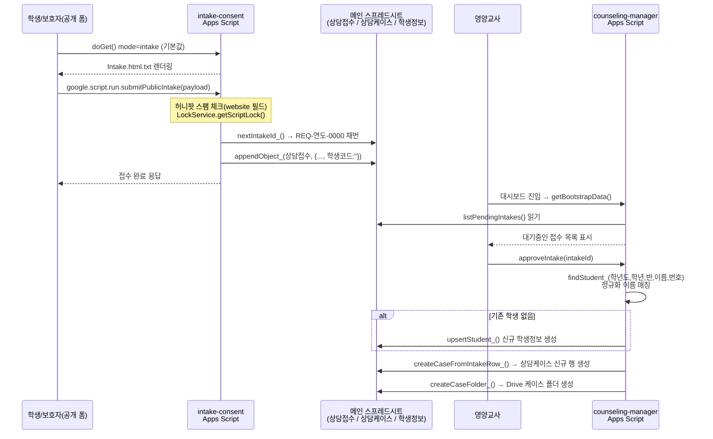
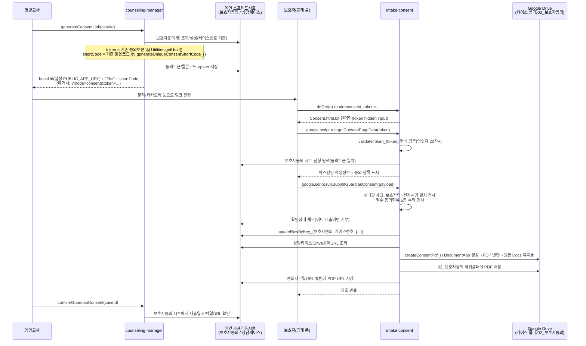
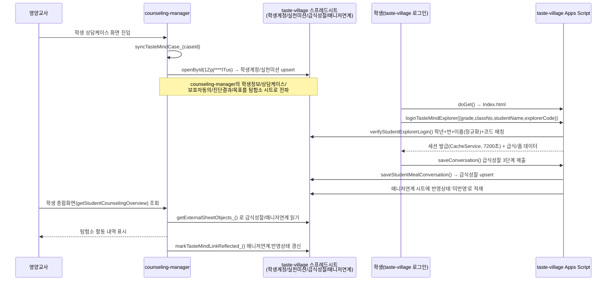

# 모듈 간 통합 흐름 (integration-flow)

> `legacy-system-map.md`에서 정리한 3개 프로젝트 간 연결을 실제 함수 호출 순서로 상세화한 문서입니다. 모든 화살표는 실제 코드에서 확인된 함수 호출/시트 읽기·쓰기에 근거합니다.

## 1. 영양상담 ↔ 상담신청 (신청 접수 → 케이스 생성)

**관련 코드**: `intake-consent/code.gs.txt:36-80` (`submitPublicIntake`), `counseling-manager/code.gs.txt:2945-3059` (`listPendingIntakes`, `approveIntake`, `createCaseFromIntakeRow_`)

두 프로젝트는 동일한 메인 스프레드시트(마스킹 `19MY****YMbI`)의 `상담접수` 시트를 공유합니다.

**핵심 포인트**: `상담접수` 시트에 저장되는 시점에는 `학생코드`가 빈 값(`intake-consent/code.gs.txt:57`)이며, 실제 학생 매칭·연결은 counseling-manager 쪽 `approveIntake`가 담당합니다. 신청과 매칭 사이에 사람이 개입(영양교사의 승인 클릭)하는 구조입니다.

## 2. 영양상담 ↔ 보호자동의 (동의 링크 발급 → 제출 → PDF 생성)

**관련 코드**: `counseling-manager/code.gs.txt:3456-3546`(`generateConsentLink`), `intake-consent/code.gs.txt:17-25`(`doGet`), `82-217`(`getConsentPageData`, `submitGuardianConsent`, `createConsentPdf_`)

**핵심 포인트 / 위험**: token에 만료 시각이 없고(코드 전체에 만료 체크 로직 없음), 재사용 방지는 `확인상태` 값이 제출 완료 상태로 바뀌기 전까지는 걸리지 않습니다. 즉 **미제출 상태의 링크는 유출 시 누구나 토큰만으로 학생 마스킹 정보를 조회 가능**합니다(`intake-consent/code.gs.txt:82-108`).

## 3. 영양상담 ↔ 맛마을 탐험소 (양방향 동기화)

**관련 코드**: `counseling-manager/code.gs.txt:1296-1334`(`getTasteMindConfig_`, `getExternalSheetObjects_`), `1409-1569`(`syncTasteMindCase_`), `taste-village/code.gs:565-598`(`verifyStudentExplorerLogin`), `MealApi.gs:104-249`(`saveStudentMealConversation`)

**핵심 포인트**: taste-village 쪽에는 counseling-manager가 자신을 어떻게 읽어가는지에 대한 코드가 없습니다(taste-village 저장소 범위 밖). 이 흐름은 counseling-manager 쪽 코드(`getExternalSheetObjects_`, `syncTasteMindCase_` 계열)에서 확인된 것이며, **두 프로젝트가 API가 아니라 스프레드시트 ID 직접 공유로 결합**되어 있다는 점이 가장 중요한 구조적 특징입니다. taste-village의 `EXPECTED_SPREADSHEET_ID`(`taste-village/code.gs:14`)와 counseling-manager의 `TASTE_MIND_DEFAULTS.SPREADSHEET_ID`(`counseling-manager/code.gs.txt:30`)가 마스킹값 기준 동일(`1Zpj****ITus`)함을 확인했습니다.

## 4. 데이터 흐름·토큰 흐름 종합

| 데이터/토큰 | 발급 주체 | 저장 위치 | 소비 주체 | 만료/검증 |
|---|---|---|---|---|
| 접수ID (`REQ-연도-0000`) | intake-consent | 메인시트.상담접수 | counseling-manager | 없음(순차 채번만) |
| 동의토큰(UUID) | counseling-manager | 메인시트.보호자동의 | intake-consent | 형식 검증만(20자+ 영숫자), 만료 없음 |
| 짧은코드(10자리) | counseling-manager | 메인시트.보호자동의 | intake-consent(`?k=` 파라미터로 추정 라우팅, 단 intake-consent의 `doGet`은 `k` 파라미터를 처리하는 코드가 확인되지 않음 — **불일치 의심**, 아래 참고) | 없음 |
| 접속토큰(탐험코드 4자리) | taste-village | 학생계정 시트 | 학생 로그인 | 만료 없음, 무차별 대입 방어 없음 |
| Gemini 응답 | Gemini API | 시트(진단결과/다음회기준비) 또는 클라이언트 임시 표시 | counseling-manager | 해당 없음 |

### 발견된 불일치: `?k=` 짧은링크 처리 코드 미확인

`counseling-manager/code.gs.txt:3497-3500`은 짧은코드를 `baseUrl + '?k=' + shortCode` 형태로 조합하지만, `intake-consent/code.gs.txt`의 `doGet(e)`(17-25행)는 `e.parameter.mode`와 `e.parameter.token`만 읽고 **`e.parameter.k`를 처리하는 코드가 확인되지 않습니다**. 즉 현재 intake-consent 코드만으로는 짧은링크(`?k=...`)가 실제로 동작하지 않을 가능성이 있습니다(레거시 링크 `?mode=consent&token=...` 형식만 동작 확인됨). 이는 추측이 아니라 코드 부재 확인이며, 마이그레이션 전 반드시 실제 배포본에서 재검증이 필요합니다.
