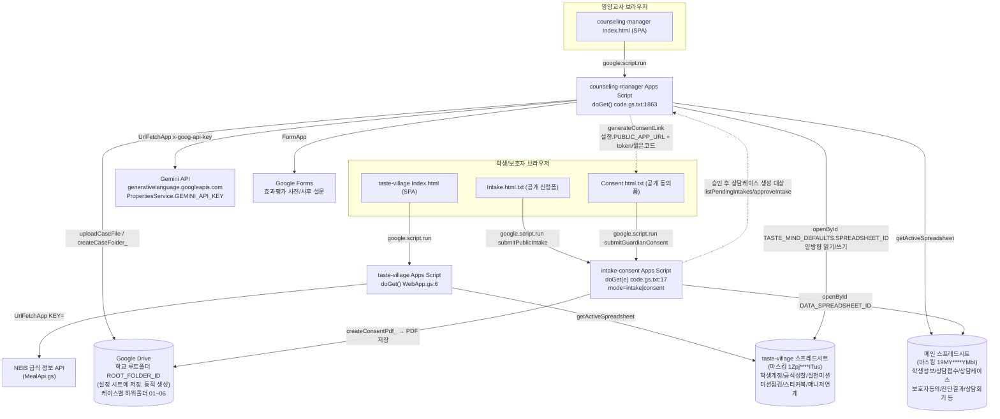

# 기존 시스템 지도 (legacy-system-map)

> 이 문서는 `legacy/counseling-manager`, `legacy/taste-village`, `legacy/intake-consent` 3개 Apps Script 프로젝트의 실제 코드(총 16,730줄)를 전수 분석한 결과입니다. 모든 서술은 파일 경로와 함수명/라인 번호를 근거로 하며, 근거를 찾지 못한 부분은 "확인되지 않음"으로 명시합니다. 민감정보(스프레드시트 ID, Web App URL 등)는 앞 4자리+뒤 4자리만 남기고 마스킹했습니다(예: `19MY****YMbI`).

## 1. 프로젝트 구성 요약

| 프로젝트 | 경로 | 진입점 | 파라미터 라우팅 | 화면(HTML) |
|---|---|---|---|---|
| AI 영양상담 매니저 | `legacy/counseling-manager/` | `doGet()` (`code.gs.txt:1863`) | 없음(항상 동일 템플릿) | `Index.html` 단일 SPA, 10개 섹션 탭 |
| 맛마을 탐험소 | `legacy/taste-village/` | `doGet()` (`WebApp.gs:6`) | 없음(항상 동일 템플릿) | `Index.html` 단일 SPA, 7개 뷰 |
| 상담신청·보호자동의 | `legacy/intake-consent/` | `doGet(e)` (`code.gs.txt:17`) | `e.parameter.mode`(`intake`/`consent`), `e.parameter.token` | `Intake.html.txt`, `Consent.html.txt` 2개 템플릿 |

세 프로젝트 모두 `doPost` 함수가 코드에 존재하지 않습니다(확인되지 않음 — 3개 프로젝트 전수 grep 결과 없음). 모든 서버 호출은 `google.script.run`을 통한 RPC 방식이며, `intake-consent`만 `doGet(e)`의 쿼리 파라미터로 화면을 분기합니다.

**중요 발견**: `counseling-manager`와 `intake-consent`는 서로 다른 Apps Script 프로젝트이지만, `intake-consent/code.gs.txt:7`의 `DATA_SPREADSHEET_ID`(마스킹 `19MY****YMbI`)와 `counseling-manager/Index.html:488`에 하드코딩된 counseling-manager 자체 스프레드시트 ID(마스킹 `19MY****YMbI`)가 **동일한 값**입니다. 즉 두 프로젝트는 **물리적으로 하나의 Google Sheets 파일을 공유하는 데이터베이스**로 동작합니다(자세한 내용은 `integration-flow.md` 참고).

## 2. 화면별 역할

### AI 영양상담 매니저 (`Index.html`, `code.gs.txt:1863` 이하)
| 섹션 ID | 역할 |
|---|---|
| `dashboard` | KPI, 월간 캘린더, 바로가기(맛마을 탐험소·데이터 시트 정적 링크 포함) |
| `intakes` | 공개 상담신청 접수 승인(`approveIntake`) |
| `consents` | 보호자 동의 링크 생성/발송/확인 |
| `diagnosis` | 공식 진단 PDF 업로드 + Gemini 자동 추출 |
| `session` | 상담 기록(SOAP/PES) 작성, Gemini 초안 생성 |
| `preparation` | 다음 회기 준비안 Gemini 생성 |
| `neis` | 나이스(NEIS) 업로드용 엑셀 내보내기 |
| `evaluation` | 효과평가·성장측정, Google Form 연동 |
| `cases` | 학생·상담 통합검색, 맛마을 탐험소 연동 패널 |
| `cleanup` | 테스트 데이터 일괄 삭제 |

### 맛마을 탐험소 (`Index.html`)
| 뷰 ID | 역할 |
|---|---|
| `loginView` | 학년·반·이름·탐험코드(4자리) 로그인 |
| `homeView` | 탐험 홈 대시보드 |
| `badgeView` | 배지책 |
| `missionView` | 현재 실천미션 점검 |
| `gameHubView`/`gamePlayView` | 자유게임 목록/플레이 |
| `notebookView` | 탐험노트(활동 타임라인) |
| `counselingView` | 급식성찰 3단계(오늘 급식→핵심 탐험→다음 급식 약속) |

### 상담신청·보호자동의
| 템플릿 | mode 값 | 역할 |
|---|---|---|
| `Intake.html.txt` | `intake`(기본값) | 상담신청 공개 폼 |
| `Consent.html.txt` | `consent` | 보호자동의 공개 폼(token 필요) |

## 3. Apps Script 프로젝트 간 연결 관계 (요약)

- **counseling-manager ↔ intake-consent**: 동일 스프레드시트 공유(`상담접수`, `상담케이스`, `보호자동의`, `학생정보` 시트). counseling-manager가 동의 링크(token/짧은코드)를 생성해 intake-consent의 배포 URL(`설정.PUBLIC_APP_URL`)로 안내하고, intake-consent는 그 링크를 받아 폼을 제공하며 제출 결과를 같은 시트에 기록.
- **counseling-manager → taste-village**: counseling-manager가 `TASTE_MIND_DEFAULTS.SPREADSHEET_ID`(`code.gs.txt:30`, 마스킹 `1Zpj****ITus`)로 taste-village의 스프레드시트를 직접 열어 `학생계정`/`실천미션` 시트에 쓰고, `급식성찰`/`매니저연계` 시트를 읽습니다. 두 프로젝트는 API 호출이 아니라 **스프레드시트 직접 공유**로 연결되어 있습니다.
- **taste-village → counseling-manager**: taste-village는 자신의 `매니저연계` 시트에 `반영상태:'미반영'`으로 활동 로그를 적재만 하고(`MealApi.gs:193-231`, `homeBadge.gs:1086-1124`), counseling-manager가 이를 다시 읽어 반영 처리합니다(`code.gs.txt` 내 `syncTasteMindCase_` 계열 함수, `1409-1569`).

전체 데이터 흐름은 `integration-flow.md`에서 시퀀스 다이어그램으로 상세히 다룹니다.

## 4. 시스템 구성도 (Mermaid)

## 5. 발견되지 않은 항목 (분석 한계)

- 세 프로젝트 모두 `appsscript.json`(배포 매니페스트)이 `legacy/`에 포함되어 있지 않아, 실제 배포 시 "실행 계정"과 "액세스 권한 범위" 설정을 코드만으로 확인할 수 없습니다.
- `legacy/sheet-structure/`에는 README만 있고 실제 시트 스키마 원본(헤더 export, 샘플 데이터)이 없어, 이 문서의 시트 구조는 전적으로 소스 코드의 상수/객체 리터럴에서 역산한 것입니다.
- counseling-manager의 `생성문서`(`SHEETS.DOCS`) 시트는 읽기 코드만 있고 쓰기 코드가 없어 실제 용도가 확인되지 않습니다.
