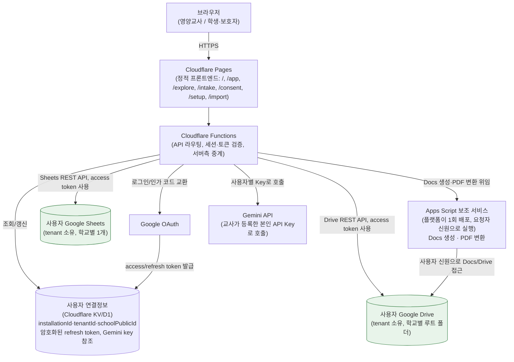
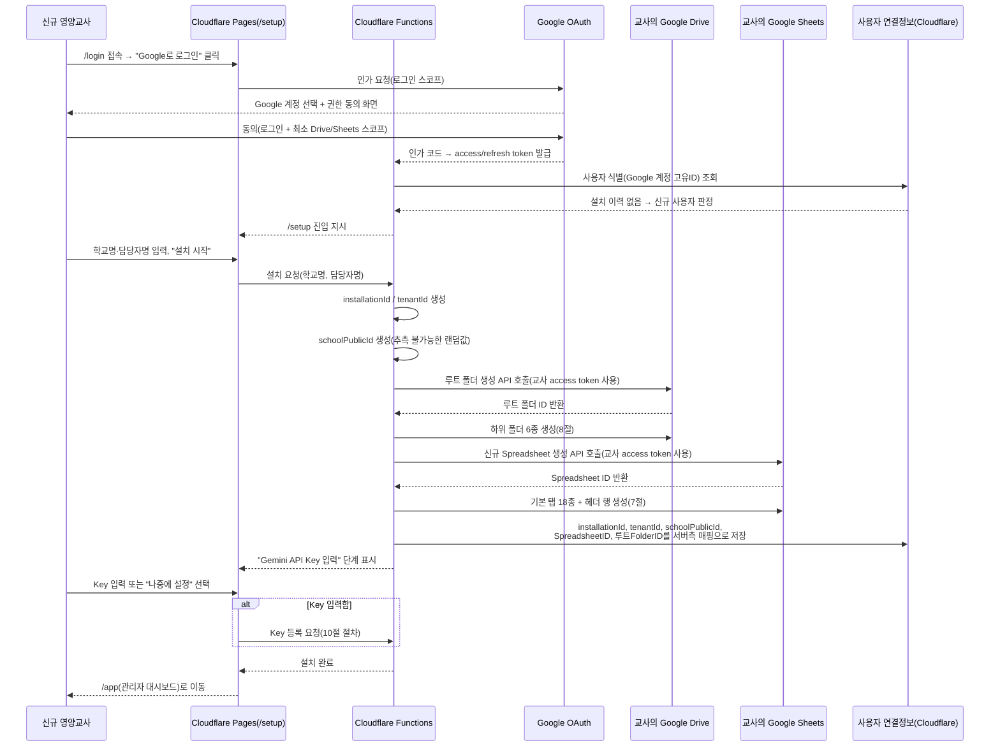

# Nutrition Platform v1 — 최종 아키텍처 설계서 (platform-v1-architecture)

> 이 문서는 `legacy-system-map.md`, `integration-flow.md`, `google-data-inventory.md`, `hardcoded-values-report.md`, `migration-risks.md`, `recommended-migration-plan.md`, `database-schema.md`, `security-principles.md`, `architecture.md`, `development-roadmap.md`의 분석 결과를 종합한 **설계 문서**입니다. 실제 기능 코드(Google OAuth, Cloudflare Functions, Apps Script 구현)는 포함하지 않으며, `legacy/` 원본은 참고만 하고 수정하지 않았습니다.

## 1. 설계 원칙

| 원칙 | 내용 |
|---|---|
| 하나의 공용 사이트 | 모든 학교의 영양교사가 동일한 도메인/코드베이스(Cloudflare Pages + Functions)를 공유한다. 학교별로 별도 배포본을 만들지 않는다. |
| 사용자별 Google 계정 연결 | 플랫폼은 자체 계정 시스템을 두지 않고, 각 영양교사가 자신의 Google 계정으로 로그인한다. 로그인 계정이 곧 tenant(작업공간) 소유자다. |
| 사용자별 데이터 분리 | 학생 데이터, 상담 기록, PDF 등은 로그인한 영양교사 본인의 Google Sheets/Drive에만 저장된다. 학교 간 데이터가 물리적으로도, 논리적으로도 섞이지 않는다. |
| 운영자 데이터 비보관 | 플랫폼 운영자는 학생 원자료를 저장하거나 열람할 수단을 갖지 않는다. 플랫폼이 서버 측에 보관하는 것은 연결·설정 메타데이터뿐이다(14절 참고). |
| 기존 기능의 단계적 이식 | `legacy/`의 3개 Apps Script 프로젝트(영양상담 매니저, 맛마을 탐험소, 상담신청·보호자동의) 기능을 한 번에 옮기지 않고, `development-roadmap.md`의 순서(로그인/설치 → 상담관리 → 맛마을 → 상담신청 → 보호자동의 → Gemini → 가져오기 → 안정화)를 따른다. |
| legacy 코드는 참고용으로만 사용 | `legacy/`는 요구사항과 위험을 파악하기 위한 읽기 전용 참고 자료다. 신규 코드는 legacy를 복사·포크하지 않고 이 설계서 기준으로 새로 작성하며, `legacy/` 원본은 수정하지 않는다. |

이 원칙들은 `security-principles.md`의 1~6항과 1:1로 대응하며, 상충하는 요구가 있을 경우 `security-principles.md`가 우선한다.

## 2. 용어 정의

| 용어 | 정의 | 발급/생성 시점 | 비고 |
|---|---|---|---|
| `user` | 로그인한 영양교사. 플랫폼의 유일한 인증 주체이며, Google 계정으로 식별된다. | Google OAuth 로그인 시 | v1에서는 1 user = 1 tenant를 가정한다(17절 미결정 사항 참고). |
| `tenant` | 한 영양교사가 운영하는 "학교 작업공간". 데이터(Sheets 행)와 파일(Drive)의 논리적 소유 경계. | 최초 설치 완료 시 | `database-schema.md`의 `tenantId`가 이 tenant를 가리키는 값이며, `installationId`와 1:1로 같은 값을 공유한다(아래 참고). |
| `schoolPublicId` | 공개 신청·맛마을 링크에 사용하는 외부 노출용 식별자. 실제 Spreadsheet ID/Folder ID와 무관한 별도 발급값. | 최초 설치 시 | 추측 불가능한 랜덤 문자열. 유출되어도 내부 리소스 ID를 노출하지 않는다. |
| `studentId` | 학교(tenant) 내부에서 학생을 식별하는 키. 전역 고유가 아니라 tenant 범위 내 고유. | 학생정보 탭에 최초 등록 시 | 이름 기반 매칭을 대체하는 1차 키(13절 참고). |
| `caseId` | 상담 건(케이스) 식별자. 한 학생이 여러 caseId를 가질 수 있다. | 상담접수 승인 또는 관리자 직접 생성 시 | `legacy-system-map.md`의 "케이스번호"에 대응. |
| `intakeId` | 상담신청 접수 1건의 식별자. | 상담신청 폼 제출 시 | 승인되면 caseId와 연결된다. |
| `consentId` | 보호자동의 1건의 식별자. | 동의 링크 발급 시 | intakeId 또는 caseId 중 최소 하나와 연결되어야 유효하다. |
| `assessmentId` | 맛마을 탐험소 검사/평가 결과 또는 AI 분석 결과의 식별자. | 검사 제출 또는 진단 저장 시 | caseId 또는 studentId에 종속. |
| `installationId` | 플랫폼이 tenant를 최초 설치할 때 발급하는 설치 단위 식별자. | 최초 설치 완료 시 | **`tenantId`와 동일한 값을 공유하는 동일 개념**이다. `installationId`는 "설치 이벤트/설치 상태"를 가리키는 관점의 이름이고, `tenantId`는 데이터 행에 찍히는 "소유자 구분자" 관점의 이름이다. 두 용어를 별도 ID 체계로 이원화하지 않는다(모순 방지를 위해 명시). |

## 3. 전체 시스템 구성도



**핵심**: 브라우저와 Google 리소스 사이에는 항상 Cloudflare Functions가 끼며, Functions는 `ConnStore`에서 해당 사용자의 access token(또는 refresh token으로 갱신한 token)을 꺼내 **그 사용자 본인 명의로** Sheets/Drive/Docs/Gemini를 호출한다. 플랫폼 자체 계정(운영자 Google 계정)으로 사용자 데이터를 대신 읽거나 쓰는 경로는 존재하지 않는다.

## 4. 사이트 경로 설계

| 경로 | 접근 주체 | 인증 | 역할 |
|---|---|---|---|
| `/` | 누구나 | 불필요 | 서비스 소개, 로그인 진입점. |
| `/login` | 영양교사(신규/기존) | 불필요(로그인 시작점) | Google OAuth 시작. 로그인 후 설치 여부에 따라 `/setup` 또는 `/app`으로 분기. |
| `/setup` | 로그인한 영양교사(설치 전) | 필요 | 최초 설치 마법사(5절) 및 재설정. 설치가 이미 끝난 사용자가 접근하면 `/app`으로 리다이렉트. |
| `/app` | 로그인한 영양교사(설치 완료) | 필요 | 영양상담 관리자 메인 화면. 자기 tenant의 Sheets/Drive만 읽고 쓴다. |
| `/explore/:publicId` | 학생(공개) | 불필요(로그인 아님, `publicId` 기반 식별) | 맛마을 탐험소. `schoolPublicId` 또는 발급된 세션 토큰으로 tenant를 식별한다. |
| `/intake/:publicId` | 학생/보호자(공개) | 불필요 | 상담신청 폼. `schoolPublicId`로 제출 대상 tenant를 식별한다. |
| `/consent/:token` | 보호자(공개) | 불필요(token 기반) | 보호자동의 폼. 만료 가능한 1회성 `token`으로 특정 case를 식별한다. |
| `/settings` | 로그인한 영양교사 | 필요 | tenant 설정(학교명, Gemini API Key, 연결 해제 등) 관리. |
| `/import` | 로그인한 영양교사 | 필요 | 기존 사용자 데이터 가져오기(6절). v1 초기 구현 범위에는 포함하지 않는다(Milestone 7). |

`/explore`, `/intake`, `/consent`는 비로그인 공개 경로이며, URL 어디에도 Spreadsheet ID/Folder ID가 노출되지 않는다(`security-principles.md` 4·5항).

## 5. 신규 사용자 최초 설치 흐름



**핵심 설계 포인트**:
- 교사는 Spreadsheet ID나 Folder ID를 어떤 입력창에도 직접 붙여넣지 않는다. 생성은 Functions가 교사의 OAuth token으로 Google API를 호출해 수행하고, 반환된 ID는 서버측 `Store`에만 저장된다. `설정` 시트나 URL에 원본 ID를 그대로 노출하지 않는다.
- 교사가 이후 "내 스프레드시트 열기" 같은 링크를 눌러 Google Sheets를 직접 열면 브라우저 주소창에는 당연히 실제 ID가 보인다(Google 자체 UI이므로 불가피). 이것과 **플랫폼이 발급하는 공개 URL(`/explore`, `/intake`, `/consent`)에 ID를 노출하는 것**은 서로 다른 문제이며, 이 설계는 후자만을 금지한다.
- `legacy`에서 확인된 문제(하드코딩된 Spreadsheet ID가 `Index.html`에 정적으로 박혀 있던 것, `hardcoded-values-report.md` 1절)는 애초에 클라이언트에 ID를 전달하지 않는 이 흐름으로 구조적으로 재발하지 않는다.

## 6. 기존 사용자 데이터 가져오기 흐름 (Milestone 7 — v1 초기 구현 범위 아님)

> 이 기능은 `/import` 경로에 대응하며, **Milestone 1~6에는 포함되지 않는다.** 아래는 후속 단계를 위한 흐름 설계이며, v1 최초 릴리스에서 구현하지 않는다.

1. **기존 영양상담 시트 선택**: 사용자가 자신의 Drive에서 기존 counseling-manager 스프레드시트를 지정(Picker 등으로 선택, ID 직접 입력 요구하지 않음).
2. **기존 맛마을 시트 선택**: 별도 스프레드시트로 존재했다면 동일한 방식으로 선택(현재 legacy 구조는 메인 시트와 taste-village 시트가 분리돼 있었음, `google-data-inventory.md` 1·2절).
3. **헤더 검사**: 선택한 시트의 탭/헤더가 7절에서 정의한 v1 스키마와 얼마나 일치하는지 자동 비교, 누락/추가 컬럼 표시.
4. **데이터 미리보기**: 실제 이전 전에 상위 N행을 마스킹된 형태로 미리보기 제공.
5. **이름 기반 → studentId 기반 변환**: legacy는 "학년도+학년+반+이름" 조합으로 학생을 매칭했다(`hardcoded-values-report.md` 5절, `findStudent_`). 가져오기 도구는 이 조합을 기준으로 studentId를 신규 발급하고, 동명이인 의심 건은 자동 병합하지 않고 검토 목록으로 분리한다.
6. **중복·오류 보고서**: 중복 학생 후보, 필수 컬럼 누락 행, 형식 오류 행을 사람이 검토할 수 있는 리포트로 출력.
7. **실제 이전 전 백업**: 원본 시트를 건드리지 않고, 대상(v1) 스프레드시트에 쓰기 전에 대상 스프레드시트 자체의 스냅샷(사본)을 8절의 `백업/` 폴더에 저장.
8. **단계별 마이그레이션**: 탭 단위(학생정보 → 상담케이스 → 상담회기 → …)로 순차 실행하며, 각 단계 완료 후 사용자가 결과를 확인하고 다음 단계로 진행하는 구조. 한 번에 전체를 커밋하지 않는다.

## 7. 사용자별 Google Sheets 구조

**우선안**: tenant(학교) 1개당 Spreadsheet 1개. legacy에서 counseling-manager/intake-consent가 공유하던 메인 스프레드시트와, taste-village가 별도로 쓰던 스프레드시트(`google-data-inventory.md` 1·2절)를 v1에서는 **하나로 통합**한다. 이는 `migration-risks.md`에서 P0로 지적된 "스프레드시트 직접 공유(openById)로 인한 결합" 문제를 애초에 제거하는 설계다.

| 탭 | 목적 | 기본 키 | 주요 외래키 |
|---|---|---|---|
| 설정 | tenant 단위 설정(학교명, 공개 URL, 모델명 등). Gemini API Key 원문은 저장하지 않음(10절). | 설정키 | — |
| 학생정보 | 학생 기본 정보(학년/반/이름 등 최소 항목). | `studentId` | — |
| 상담접수 | 상담신청(`/intake`) 제출 원본. | `intakeId` | `studentId`(승인 전 null 가능) |
| 보호자동의 | 동의 요청/제출 이력. | `consentId` | `intakeId` 또는 `caseId`(둘 중 최소 1개 필수) |
| 상담케이스 | 상담 진행의 허브 테이블. | `caseId` | `studentId` |
| 진단결과 | 공식 진단/AI 추출 결과. | `assessmentId` | `caseId` |
| 상담회기 | 회기별 상담 기록(SOAP/PES 등). | `sessionId` | `caseId` |
| 실천목표 | 회기에서 설정한 실천 목표. | `goalId` | `caseId`, `sessionId` |
| 목표점검 | 실천목표 이행 점검 이력. | `checkId` | `goalId` |
| 효과평가 | 상담 전/후 효과 평가. | `evaluationId` | `caseId` |
| 성장측정 | 신체 성장 측정치 이력. | `measurementId` | `caseId` |
| 다음회기준비 | 다음 회기 준비안(Gemini 생성 가능). | `preparationId` | `caseId`, `sessionId` |
| 맛마을검사 | 맛마을 탐험소 공개 검사 링크 제출 원본. | `assessmentId` | `studentId`(제출 시점에 연결) |
| 맛마을결과 | 맛마을 검사의 채점/정리된 결과. | `resultId` | `assessmentId`, `studentId` |
| 생성문서 | Gemini/상담 과정에서 생성된 문서의 메타데이터(파일명, Drive 파일 참조, 생성 시각). 실제 파일 본문은 Drive에만 저장. | `docId` | `caseId` |
| 일정관리 | 상담 일정. | `scheduleId` | `caseId`(선택) |
| 일정완료 | 일정 완료 처리 이력. | `completionId` | `scheduleId` |
| 변경이력 | tenant 내 주요 데이터 변경 감사로그. | `logId` | 대상 레코드 ID(가변) |

> `생성문서` 탭은 `legacy-system-map.md`·`google-data-inventory.md`에서 "쓰기 코드가 확인되지 않는 탭"으로 지적된 항목이다. v1에서는 위 정의(문서 메타데이터 인덱스)를 목표 스키마로 채택하되, 실제 legacy 운영 데이터에 이 탭이 다른 용도로 쓰인 이력이 있는지는 후속 조사가 필요하다(17절).
> `맛마을검사`/`맛마을결과` 2탭은 legacy taste-village의 7개 탭(학생계정, 회기활동, 급식성찰, 실천미션, 미션점검, 스티커북, 매니저연계)을 단순화한 v1 목표 스키마다. 세부 탭 통폐합 매핑은 Milestone 3(맛마을 이전) 착수 시 별도로 확정한다(17절).

## 8. Google Drive 폴더 구조

설치 시 사용자의 Drive에 아래 구조를 자동 생성한다.

```
AI 영양플랫폼/
├─ 보호자동의서/
├─ 상담생성문서/
├─ 검사파일/
├─ 맛마을결과/
├─ 임시파일/
└─ 백업/
```

| 폴더 | 소유자 | 파일 생성 주체 |
|---|---|---|
| `AI 영양플랫폼/`(루트) | 로그인한 영양교사(사용자) | 최초 설치 흐름(Functions가 사용자 access token으로 생성) |
| `보호자동의서/` | 사용자 | 보호자동의(`/consent`) 제출 시 PDF 생성 경로(11-D절). Apps Script 보조 서비스가 요청자 신원으로 씀. |
| `상담생성문서/` | 사용자 | 영양상담 관리자(`/app`)에서 상담 결과 문서를 생성할 때. |
| `검사파일/` | 사용자 | 공식 진단 PDF 등 사용자가 직접 업로드하는 원본 파일. |
| `맛마을결과/` | 사용자 | 맛마을 탐험소 검사 결과 산출물(있는 경우). |
| `임시파일/` | 사용자 | NEIS 업로드 엑셀 등 일시적 산출물. 일정 기간 후 정리 대상(구체 정책은 17절 미결정). |
| `백업/` | 사용자 | `/import`(Milestone 7) 실행 전 자동 백업 스냅샷. |

모든 폴더/파일은 **사용자 본인의 Drive 용량과 소유권** 안에 생성된다. 플랫폼 운영자의 Google 계정이나 서비스 계정 소유로 파일이 생성되는 경로는 설계상 존재하지 않는다(`migration-risks.md`의 "운영자 Drive에 여러 학교 파일이 섞일 가능성" P1 위험에 대한 구조적 대응).

## 9. Google OAuth 설계

코드 구현 없이 권한·흐름만 설계한다.

- **로그인 권한과 Drive/Sheets 권한 분리**: 최초 `/login` 단계에서는 "누구인지 식별"에 필요한 최소 스코프(OpenID/이메일/프로필)만 요청한다. Drive/Sheets 접근이 필요한 시점(`/setup` 설치 흐름 진입)에 별도로 Drive/Sheets 스코프 동의를 요청한다. 이렇게 하면 단순 로그인만으로 Drive 전체 권한을 미리 쥐지 않는다.
- **최소 권한 원칙**: Drive 스코프는 "앱이 생성한 파일에만 접근"하는 범위(예: `drive.file` 유형의 범위)를 우선 사용하고, Drive 전체를 열람할 수 있는 범위는 요청하지 않는다. Sheets도 앱이 만든/연결한 스프레드시트로 범위를 제한한다.
- **access token / refresh token 처리**: access token은 단기 수명이며 요청 시점에만 메모리에서 사용하고 영속 저장하지 않는다. refresh token은 서버측(`Store`)에 암호화 저장하며, access token 만료 시 서버가 자동 갱신한다. refresh token 자체는 브라우저로 전달하지 않는다.
- **사용자 연결 해제**: `/settings`에서 "Google 연결 해제"를 실행하면 (1) Google 계정 자체의 토큰을 즉시 폐기(revoke) 요청하고 (2) 플랫폼 서버측에 저장된 refresh token/access token을 삭제한다. Sheets/Drive의 실제 데이터는 삭제하지 않는다(14절).
- **재인증**: refresh token이 만료/폐기되어 갱신에 실패하면, 사용자를 다시 `/login`으로 안내해 재동의를 받는다. 재인증 시 기존 installationId/tenantId는 유지하고 토큰만 교체한다.
- **Workspace 학교 계정의 관리자 제한 대응**: 학교가 Google Workspace for Education 등으로 운영되는 경우, 조직 관리자가 서드파티 앱 접근을 화이트리스트 방식으로 제한할 수 있다. 이 경우 교사 개인 동의만으로는 OAuth가 완료되지 않을 수 있다. 설계상으로는 (1) 로그인 실패 시 "관리자 승인이 필요합니다" 안내를 명확히 하고, (2) 학교 IT 담당자가 앱을 화이트리스트에 추가할 수 있도록 앱 정보(클라이언트 ID, 요청 스코프 목록)를 안내 페이지로 제공하는 것을 전제로 한다. 구체적 승인 절차 지원 방식은 17절 미결정 사항.
- **플랫폼 운영자가 사용자 Drive 전체를 볼 수 없도록 하는 범위 검토**: `drive` 전체 범위 대신 `drive.file`(앱이 만들거나 사용자가 명시적으로 앱과 공유한 파일만) 범위를 채택하면, 설령 토큰이 유출되더라도 사용자 Drive의 다른 개인 파일에는 접근할 수 없다. 이 범위 선택은 "운영자가 사용자 Drive를 열람할 수 없다"는 설계 원칙을 기술적으로 뒷받침하는 핵심 장치이며, 실제 스코프 값 확정은 구현 착수 시점에 Google API 문서 기준으로 재검증한다.

## 10. 사용자별 Gemini API Key 설계

### 방식 비교

| 방식 | 설명 | 평가 |
|---|---|---|
| A. 사용자의 Apps Script `UserProperties` | legacy counseling-manager가 이미 사용 중인 방식(`PropertiesService.getScriptProperties()`, `hardcoded-values-report.md` 3절 — 정확히는 Script Properties). 사용자별 Apps Script 실행 컨텍스트에 저장. | 안전하지만, 플랫폼이 Apps Script를 점진적으로 축소·이관하는 로드맵(12·16절)과 맞지 않는다. Cloudflare Functions가 Gemini를 직접 호출하는 v1 목표 구조와 저장 위치가 어긋나 매 호출마다 Apps Script를 경유해야 하는 비효율이 생긴다. |
| B. Cloudflare의 사용자별 암호화 저장소 | Cloudflare Functions/Workers 환경에서 tenant별로 키를 암호화해 저장(예: KV/D1에 저장하되 값 자체는 서버측 비밀키로 암호화). | **v1 채택안.** 모든 API 중계가 이미 Cloudflare Functions를 거치므로 저장 위치와 사용 위치가 일치한다. Apps Script 존치 여부와 무관하게 동작한다. |
| C. 사용자 Google Sheet 설정 탭에 평문 저장 | legacy `설정` 시트 패턴을 그대로 Gemini Key에 적용하는 방식. | **채택하지 않음.** 시트는 공유 설정이 바뀌거나(공동 편집자 추가, 링크 공유 등) 실수로 노출될 수 있고, `security-principles.md` 3항("GitHub나 브라우저에 저장하지 않음")의 취지를 넘어 애초에 Google Sheets 자체도 안전한 시크릿 저장소가 아니다. |

### v1 추천 방식: **B. Cloudflare 사용자별 암호화 저장소**

| 항목 | 설계 |
|---|---|
| 입력 | `/settings`에서 1회 입력. 입력값은 HTTPS로 Cloudflare Functions에만 전송되며, 프론트엔드 상태(리덕스/스토어 등)에 원문을 보관하지 않는다. |
| 저장 | Functions가 수신 즉시 서버측에서 암호화(예: 플랫폼이 보유한 마스터 키로 AES-GCM 등)한 뒤 tenant(installationId) 단위로 저장. 평문은 저장소에 남기지 않는다. |
| 호출 | Gemini 호출이 필요한 요청마다 Functions가 저장소에서 복호화해 서버 프로세스 메모리 내에서만 사용하고, 호출 종료 즉시 폐기한다. 복호화된 키를 응답 바디에 포함하지 않는다. |
| 삭제 | `/settings`에서 "Key 삭제" 실행 시 저장소에서 즉시 제거하고 변경이력(감사로그)에 기록한다. |
| 키 유효성 검사 | 등록 시 저비용 테스트 호출(가능한 가장 저렴한 Gemini 엔드포인트/모델로 최소 요청)을 서버에서 수행해 유효성을 확인한 뒤에만 저장을 확정한다. |
| 브라우저 비노출 | 등록 이후 어떤 API 응답에도 키 원문을 다시 내려주지 않는다(마스킹된 마지막 4자리 정도만 표시). |
| GitHub 비노출 | 코드/커밋/레포지토리에는 키 값이 존재하지 않는다. 저장은 전적으로 Cloudflare 런타임 시크릿/저장소 안에서만 이뤄진다(`security-principles.md` 3·6항과 동일한 원칙). |

## 11. 모듈 연결 구조

### A. 영양상담 관리자 (`/app`)
- 로그인 사용자만 접근(9절 인증 필요).
- 자기 tenant의 Sheets만 읽고 쓴다 — Functions는 요청자의 installationId로 대상 Spreadsheet를 결정하며, 다른 tenant의 ID를 파라미터로 받아 접근하는 경로를 허용하지 않는다.
- 대시보드 등 진입 시 필요한 탭만 지연 로딩(예: 초기 진입은 학생정보+상담케이스 요약만, 상세 화면 진입 시 진단결과/상담회기 등 로딩).

### B. 맛마을 탐험소 (`/explore/:publicId`)
- 공개 검사 링크는 `assessmentId` 또는 충분히 긴 랜덤 토큰을 사용한다. legacy의 4자리 탐험코드(`taste-village/code.gs:1052-1057`, `hardcoded-values-report.md` 6절)는 **폐기**한다 — 무차별 대입 방어가 없는 구조를 신규 설계에 들여오지 않는다.
- 학생 제출 결과는 `publicId`로 식별된 tenant의 `맛마을검사`/`맛마을결과` 탭에만 저장된다.
- 학생 연결은 `studentId` 기준으로 이뤄지며, 최초 제출 시 이름/학년/반으로 studentId를 매칭 또는 신규 발급하되 신규 발급은 반드시 검토 절차(교사 승인)를 거친다.
- legacy의 학교명·NEIS 코드·Spreadsheet ID 하드코딩(`hardcoded-values-report.md` 2절, `taste-village/code.gs:118`, `MealApi.gs:9-11`)은 전부 tenant 설정값으로 대체하고 코드 상수를 두지 않는다.

### C. 상담신청 (`/intake/:publicId`)
- `schoolPublicId` 기반 공개 링크만 사용하며, URL/응답 어디에도 실제 Spreadsheet ID를 노출하지 않는다.
- 중복·스팸 방지: legacy의 허니팟 필드(`intake-consent/code.gs.txt:37,111`)만으로는 부족하다고 이미 지적됐으므로(`migration-risks.md` 2절 P2), v1에서는 허니팟에 더해 요청 빈도 제한(rate limiting)과 동일 학생 중복 신청 감지를 함께 설계한다. 구체 봇 방지 솔루션 채택 여부는 17절 미결정.
- 제출 결과는 해당 tenant의 `상담접수` 탭에 `intakeId`로 저장되고, `studentId`는 승인 전까지 비어 있을 수 있다(`database-schema.md` 3절과 동일).

### D. 보호자동의 (`/consent/:token`)
- `token`은 충분히 길고 예측 불가능한 무작위 값을 사용한다(legacy의 UUID 방식은 유지하되, **만료 시각을 반드시 추가**한다 — legacy는 만료 체크 로직이 전혀 없었다, `integration-flow.md` 2절, `migration-risks.md` P0).
- **만료시간**: 발급 시각 + TTL(예: 72시간)을 함께 저장하고, 만료 후에는 조회 자체를 거부한다.
- **1회 사용 또는 재제출 정책**: 제출 완료 후 동일 token으로 재열람/재제출이 가능한지 여부를 정책으로 명시한다(기본값은 1회 제출 후 조회만 허용, 재제출은 교사가 새 token을 재발급해야 가능). 구체 재제출 허용 범위는 17절에서 확정 필요.
- **토큰 해시 저장**: 서버(또는 tenant 시트)에는 token 원문이 아니라 해시값만 저장하고, 사용자가 링크로 전달받은 원문 token과 대조(해시 비교)하는 방식으로 검증한다. legacy는 원문 token을 시트에 그대로 저장했다(`google-data-inventory.md` 1절 "동의토큰" 컬럼) — v1은 이를 해시 저장으로 전환한다.
- 제출 후 결과는 해당 tenant의 `보호자동의` 탭에 저장된다.
- PDF는 Apps Script 보조 서비스(또는 Google Docs/Drive REST API)를 통해 **요청을 발급한 교사 본인의 Drive**(`보호자동의서/` 폴더)에 저장되며, 운영자 계정이나 공용 저장소에는 저장되지 않는다.

## 12. Cloudflare와 Apps Script 역할 분담

| 기능 | 분류 | 근거 |
|---|---|---|
| 프론트엔드 | **A. Cloudflare로 이전** | 정적 SPA/페이지, Cloudflare Pages가 표준 역할. |
| 로그인 | **A. Cloudflare로 이전** | OAuth 인가 코드 교환/세션 발급은 Functions가 전담(9절). Apps Script는 로그인에 관여하지 않는다. |
| 공개 토큰 검증 | **A. Cloudflare로 이전** | `schoolPublicId`/`consent token` 검증은 순수 로직이며 REST API로 충분(11절). |
| 기본 Sheets CRUD | **A. Cloudflare로 이전** | Google Sheets REST API로 대체 가능. legacy처럼 같은 Apps Script 런타임 안에서 다른 스프레드시트를 여는 방식(`openById` 직접 결합)은 폐기한다(`migration-risks.md` 4절). |
| Gemini 호출 | **A. Cloudflare로 이전** | 순수 REST 호출이며 10절 설계상 Functions가 키를 보관·사용하는 주체이므로 자연스럽게 A. |
| Google Docs 생성 | **C. 초기에는 Apps Script 유지 후 추후 이전** | `DocumentApp`은 Apps Script 전용 API로, Docs REST API 재구현 비용이 크다(`migration-risks.md` 4절). |
| PDF 변환 | **C. 초기에는 Apps Script 유지 후 추후 이전** | Docs 생성과 동일한 이유로 묶여 있다(`createConsentPdf_` 패턴). |
| Drive 폴더 생성 | **A. Cloudflare로 이전** | Drive REST API로 폴더 생성은 비교적 단순하며, 최초 설치 흐름(5절)에서 이미 Functions가 직접 수행하는 것으로 설계했다. |
| 파일 업로드 | **A. Cloudflare로 이전** | Drive REST(resumable upload 등)로 대체 가능, Apps Script 의존 불필요. |
| 보호자동의 PDF | **C. 초기에는 Apps Script 유지 후 추후 이전** | Docs 생성/PDF 변환에 종속되므로 동일 분류. |
| 상담 생성문서 | **C. 초기에는 Apps Script 유지 후 추후 이전** | 동일하게 Docs 생성에 종속. |

**Apps Script 보조 서비스의 실행 신원**: C로 분류된 기능(Docs 생성, PDF 변환)을 담당하는 Apps Script는 tenant마다 별도로 배포하지 않고 **플랫폼이 한 번만 배포**하되, "요청을 보낸 사용자 본인의 신원으로 실행"되는 방식을 전제로 설계한다(정확한 배포/인가 방식은 구현 단계에서 Google Apps Script 배포 옵션을 검토해 확정 — 17절 미결정). 이는 "하나의 공용 사이트" 원칙(1절)을 Apps Script 계층에도 동일하게 적용하기 위함이며, tenant별 Apps Script 프로젝트를 만들던 legacy 패턴을 반복하지 않는다.

## 13. 보안 설계

`migration-risks.md`에서 발견된 문제와 v1 대응책.

| 문제 | 근거(legacy) | v1 대응책 |
|---|---|---|
| 보호자동의 토큰 만료 없음 | `intake-consent/code.gs.txt:82-108`, 만료 체크 로직 부재 | 발급 시각+TTL 저장, 만료 후 조회 거부, 토큰 해시 저장(11-D절) |
| Spreadsheet ID/URL 클라이언트 노출 | `counseling-manager/Index.html:470,488,500` | 클라이언트/공개 URL에 원본 ID를 전달하지 않음, Functions가 서버측 매핑으로만 참조(5·9절) |
| 학교명·NEIS·Spreadsheet ID 하드코딩 | `taste-village/code.gs:14,118`, `MealApi.gs:9-11` | 모든 값을 설치 시 tenant 설정으로 자동 주입, 코드 상수 제거(11-B절) |
| 이름 기반 학생 매칭 | `counseling-manager/code.gs.txt:5842-5851`, `taste-village/code.gs:565-598` | `studentId`를 1차 키로 강제, 이름은 보조 검증에만 사용(2절, 11절) |
| 맛마을 4자리 관리자 코드 | `taste-village/code.gs:1052-1057`, 무차별 대입 방어 없음 | 4자리 코드 폐기, `assessmentId`/긴 토큰으로 대체(11-B절) |
| 운영자 계정 Drive에 파일 저장 가능성 | `counseling-manager/code.gs.txt:5815-5823`, `ROOT_FOLDER_ID` 미설정 시 실행 계정 Drive에 자동 생성 | 모든 생성 API 호출을 사용자 access token으로 실행, 운영자 계정으로 파일이 생성되는 코드 경로 자체를 두지 않음(3·8절) |
| 공개 신청 스팸·중복 제출 | `intake-consent/code.gs.txt:37,111`, 허니팟만 존재 | 허니팟 + rate limiting + 중복 신청 감지(11-C절, 구체 솔루션은 17절 미결정) |
| 사용자별 Gemini API Key 보호 | `counseling-manager/code.gs.txt:1846-1856`(prompt UX), 평문 시트 저장 방식 배제 필요 | Cloudflare 서버측 암호화 저장, 브라우저/GitHub 비노출(10절) |

## 14. 데이터 소유권

- **Google Sheets와 Drive 파일의 소유자는 사용자**다. 플랫폼은 어떤 tenant 데이터에 대해서도 Google 계정 수준의 소유권을 갖지 않는다.
- **플랫폼 운영자는 앱 코드와 서비스 운영만 담당**한다. 학생 개인정보의 처리자가 아니라, 사용자가 자신의 Google 계정으로 데이터를 다루도록 돕는 도구를 제공하는 역할에 한정된다.
- **연결 해제/탈퇴 시에도 사용자 Drive 데이터는 자동 삭제하지 않는다.** 9절의 연결 해제는 플랫폼-Google 간 인증 연결만 끊으며, 사용자의 Sheets/Drive 파일은 그대로 사용자 소유로 남는다.
- **플랫폼 측에 반드시 저장해야 하는 최소 메타데이터**:
  - `installationId` / `tenantId`
  - 로그인 계정 식별자(Google 고유 ID, 이메일 — 인증/연결 목적에 한함)
  - `schoolPublicId`
  - 사용자 Spreadsheet ID, Drive 루트 폴더 ID(서버측 참조 전용, 클라이언트 비노출)
  - 암호화된 OAuth refresh token
  - 암호화된 Gemini API Key(선택 등록 시)
  - tenant 설정값(학교명, 활성화된 모듈, 생성 시각/갱신 시각 등 운영 메타데이터)
  - 플랫폼 차원의 감사로그(설치/연결해제/키 등록·삭제 등 운영 이벤트. 학생 데이터 내용은 포함하지 않음)
- **플랫폼 운영자가 저장하지 않아야 하는 학생 원자료**:
  - 학생 이름, 학년/반, 신체·건강 정보
  - 상담 기록, 진단 결과, 실천목표/점검 내용
  - 보호자 성명·연락처·동의 내용
  - 맛마을 탐험소 검사 응답/결과
  - 상담 생성 문서, 보호자동의 PDF, 진단 PDF 등 모든 파일 본문
  - 위 항목은 예외 없이 사용자의 Google Sheets/Drive에만 존재한다.

## 15. 첫 번째 구현 범위 (Milestone 1)

| 포함 | 제외 |
|---|---|
| 기본 웹 화면(`/`, `/login`, `/setup`, `/app` 뼈대) | 맛마을 탐험소(`/explore`) |
| Google 로그인(9절 로그인 스코프) | 상담신청(`/intake`) |
| 최초 설치 화면(5절 흐름 중 Gemini Key를 제외한 부분) | 보호자동의(`/consent`) |
| 사용자 Drive에 Spreadsheet + 폴더 자동 생성(5·7·8절) | Gemini 연동(6·10절은 설계만, 구현은 Milestone 6) |
| 설치 상태 저장(installationId/tenantId 등 최소 메타데이터, 14절) | 데이터 가져오기(`/import`, Milestone 7) |
| 관리자 화면에서 `설정` 탭과 `학생정보` 탭 읽기 | 상담케이스 이하 나머지 탭의 전체 CRUD(Milestone 2) |
| 로그아웃과 연결 해제(9절) | — |

Milestone 1의 목표는 "로그인한 교사가 설치를 완료하면, 자기 소유의 Spreadsheet/Drive 구조가 자동으로 만들어지고, 관리자 화면에서 그 안의 최소 데이터를 읽을 수 있다"는 것을 검증하는 것이다.

## 16. 단계별 개발 로드맵

| Milestone | 범위 |
|---|---|
| M1 | 로그인과 설치(15절) |
| M2 | 학생정보와 상담 핵심 CRUD(학생정보/상담케이스/상담회기 등 나머지 탭) |
| M3 | 맛마을 탐험소(`/explore`, `assessmentId` 기반 공개 링크, `맛마을검사`/`맛마을결과` 탭) |
| M4 | 상담신청(`/intake`, `schoolPublicId` 기반, 스팸 방지) |
| M5 | 보호자동의와 PDF(`/consent`, 토큰 TTL/해시, Apps Script Docs→PDF 경로) |
| M6 | Gemini(사용자별 Key 등록·호출, 10절 설계 구현) |
| M7 | 기존 데이터 가져오기(`/import`, 6절 흐름 구현) |
| M8 | 안정화와 배포(Cloudflare CI/CD, 환경별 배포, 회귀 테스트) |

`development-roadmap.md`의 9단계 로드맵과 일관되며, 이 문서의 Milestone 번호는 해당 로드맵의 2~9단계에 대응한다.

## 17. 미결정 사항

아래 항목은 이 설계서에서 추측으로 확정하지 않았으며, 각 Milestone 착수 전에 별도로 결정이 필요하다.

- **Apps Script 보조 서비스의 정확한 배포/인가 방식**: "요청자 신원으로 실행"을 어떤 Apps Script 배포 옵션(예: 웹앱 배포의 실행 계정 설정)으로 구현할지, 이 경우 사용자가 Google 로그인 외에 Apps Script 앱에 대한 별도 동의 화면을 한 번 더 거쳐야 하는지 여부(12절).
- **taste-village 스프레드시트 완전 통합 여부의 세부 검증**: 7절에서 하나의 스프레드시트로 통합하는 것을 우선안으로 제시했으나, 실제 데이터 볼륨/Google Sheets 셀 한도(파일당 셀 수 제한)를 고려했을 때 대규모 학교에서 문제가 없는지 Milestone 3 착수 전 검증 필요.
- **legacy 7개 맛마을 탭 → v1 2개 탭(`맛마을검사`/`맛마을결과`) 매핑 세부안**: 현재는 목표 스키마만 정의했고, 실제 필드 단위 매핑은 정하지 않았다(7절).
- **`생성문서` 탭의 실제 legacy 용도 재조사 결과 반영**: 쓰기 코드가 확인되지 않은 채로 목표 스키마를 제안했으므로(7절), 실제 운영 스프레드시트 확인 후 재검토 필요(`migration-risks.md` 3절과 동일 이슈).
- **Google Workspace 관리자 화이트리스트 승인 지원의 구체 방식**: 학교 IT 담당자를 위한 안내 페이지/문서를 플랫폼이 어떤 형태로 제공할지(9절).
- **`drive.file` 등 정확한 OAuth 스코프 목록 확정**: 최소 권한 원칙(9절)의 구체적 스코프 문자열은 구현 착수 시점에 Google API 공식 문서로 재검증해야 한다.
- **보호자동의 재제출 정책의 정확한 범위**: 1회 제출 후 재제출을 아예 금지할지, 교사 승인 하에 재발급을 허용할지(11-D절).
- **공개 신청/맛마을 스팸 방지의 구체 솔루션**: Turnstile 등 특정 서비스 채택 여부와 요청 빈도 제한(rate limit)의 정량 기준(11-C절, 13절).
- **`?k=` 짧은코드 링크 방식의 존치 여부**: legacy에서 생성부(counseling-manager)와 소비부(intake-consent)의 불일치가 의심됐던 기능(`integration-flow.md` 4절)이다. 이 설계서는 v1에서 긴 token 방식만 채택하고 짧은코드는 재구현하지 않는 것으로 정리했으나, 사용 편의성 때문에 향후 별도 단축링크 기능을 추가할지는 별도 결정 필요.
- **`임시파일/` 폴더의 보관 기간·정리 정책**(8절).
- **한 tenant(학교)에 영양교사 2인 이상(다중 관리자)을 허용할지 여부**: v1은 "1 user = 1 tenant"를 가정했다(2절). 공동 운영 학교의 요구가 있을 경우 tenant-사용자 관계를 1:N으로 확장하는 설계가 추가로 필요하다.
- **탈퇴/연결 해제 후 플랫폼 서버측 메타데이터(14절 최소 메타데이터)의 보존 기간**: 즉시 삭제할지, 일정 기간 보관 후 삭제할지 정책 미정.
